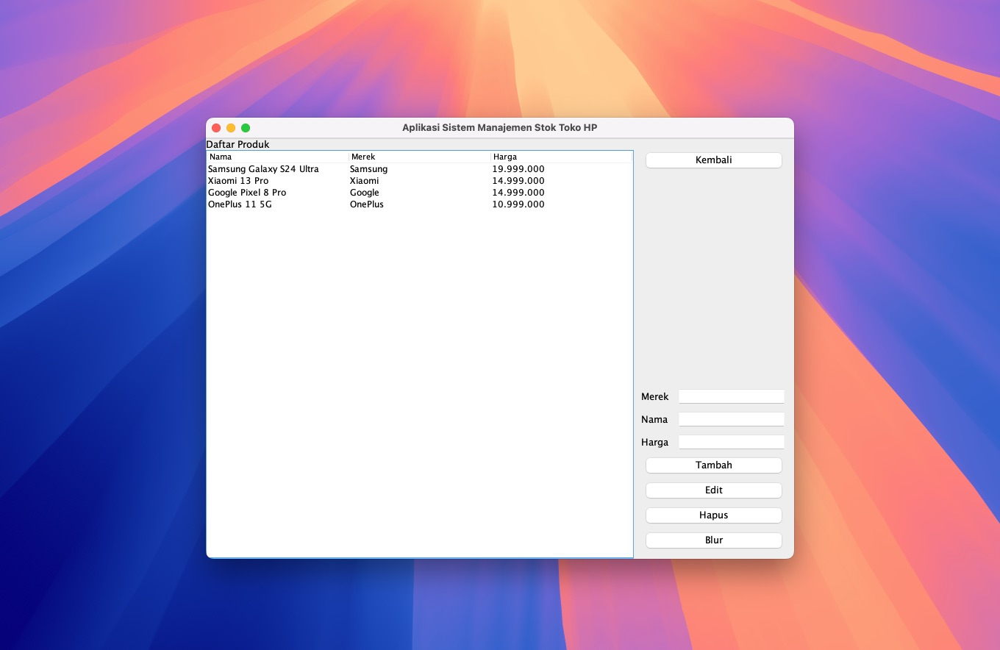

# Proyek UAS Pemrograman Berorientasi Objek 1

Ini adalah proyek UAS untuk memenuhi tugas UAS pada mata kuliah Pemrograman Berorientasi Objek 1.


*Halaman login aplikasi.*


*Halaman utama aplikasi.*


*Halaman daftar produk.*


*Halaman stok produk.*

## Cara Build

1. Buka terminal atau command prompt.
2. Arahkan ke direktori proyek ini.
3. Jalankan perintah berikut untuk membangun proyek:
    ```shell
    javac -d out/production/proyek-uas-pbo src/*.java
    ```
4. Hasil build akan tersedia di direktori `out/production/proyek-uas-pbo`.

## Cara Menjalankan

1. Pastikan JDK telah terinstal di sistem.
2. Buka terminal atau command prompt.
3. Arahkan ke direktori proyek ini.
4. Jalankan kelas Main dengan perintah berikut:
    ```shell
    java -cp out/production/proyek-uas-pbo Main
    ```

## Cara Login

Setelah aplikasi dijalankan, pengguna akan diminta untuk melakukan login. Gunakan kredensial berikut untuk masuk:

* Username: `admin`
* Password: `admin`

Jika username dan password yang dimasukkan benar, pengguna akan diarahkan ke antarmuka utama aplikasi. Jika salah, pesan kesalahan akan ditampilkan.
